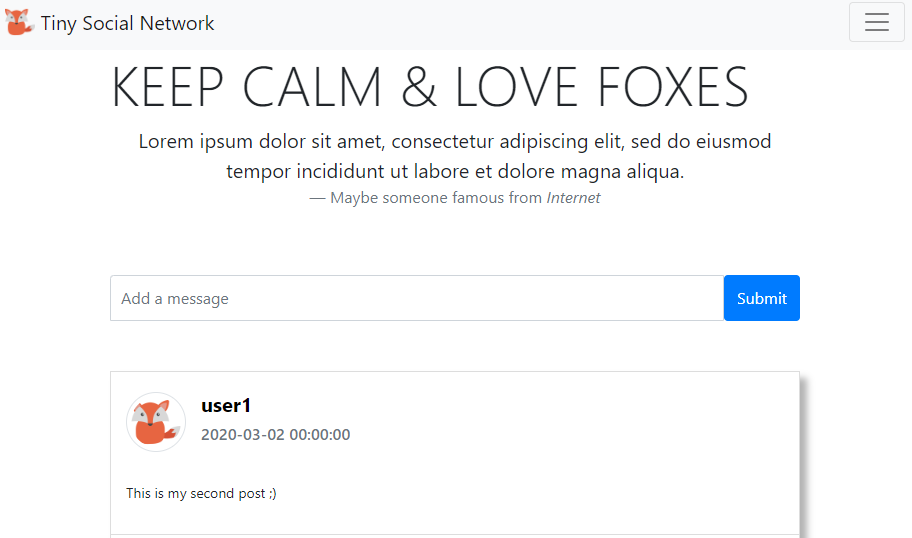
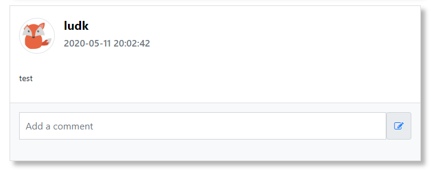

# Tiny Social Network

*Lire ceci dans une autre langue: [English](README.md), [Français](README.fr.md)*

## Bonjour

Ce projet consiste à réaliser un mini réseau social où les utilisateurs (**USER**s) peuvent poster des messages (**POST**) et commenter (**COMMENT**) ces même messages.

### Objectif

Ce projet a été réalisé pour une mise en pratique des cours de PHP que je dispense.
L'objectif est de revoir entièrement la **syntaxe PHP** et d'utiliser **PDO** (PHP Data Objects) pour accéder aux données stockées en base de données.


### Base de données

La structure est très simple :


### MVC

Il s'agit d'une simple architecture **MVC** par contre **sans POO** (Programmation Orientée Objet).

```
+---config/
|       data.sql
|       structure.sql
|       
+---controllers/
|       controller.php
|       
+---models/
|       PDO.php
|       PostManager.php
|       CommentManager.php
|       UserManager.php
|       
+---views/
|       DisplayPosts.php
|       LoginForm.php
|       RegisterForm.php
|       
\---web/
    |   index.php      <----- point d'entrée du site
    |   
    +---css/
    +---img/       
    \---js/
```

## Bien commencer

Ces instructions vont vous permettre d'avoir une copie fonctionnelle tournant sur votre ordinateur.

### Prérequis

Vous avez besoin d'une architecture **L.A.M.P.**  déjà opérationnelle.

Sinon veuillez installer les choses manquantes (instructions pour Ubuntu ci-dessous).

**Un Serveur MySQL**:

Installation

```sh
sudo apt-get install mysql-server
```

Démarrer le serveur MySQL

```sh
sudo systemctl start mysql
```

Créer un nouvel utilisateur MySQL.
Bien sûr, vous pouvez adapter les requêtes SQL pour remplacer **dbuser** et **1234Soleil!** par vos propres **nomutilisateur** et **motdepasse**, simplement pensez à les noter car nous en auront besoin plus tard.

```sh
sudo mysql
```
```sql
CREATE USER 'dbuser'@'localhost' IDENTIFIED BY '1234Soleil!';
GRANT ALL PRIVILEGES ON * . * TO 'dbuser'@'localhost';
EXIT;
```

**Un Serveur Apache2**:

Installation

```sh
sudo apt-get install apache2
```

Démarrer le serveur Apache2

```sh
sudo systemctl start apache2
```

**PHP & PDO**:

Installation

```sh
sudo apt update
sudo apt install php php-cli php-mysql
```

Redémarrer apache2:

```sh
sudo systemctl restart apache2
```


### Installation

- Faites un **Fork** de ce repo puis un git **Clone** sur votre ordinateur dans le **DocumentRoot** de votre serveur apache (par défaut sous Ubuntu il s'agit de /var/www/html).

  ```sh
  cd /var/www/html
  git clone https://github.com/YOUR-USERNAME/socialnetwork
  ```

- Créer la base de données et y injecter un jeu de tests:

  Aller dans le **répertoire config** and exécuter les <u>2 scripts SQL</u> (remplacer **dbuser** par votre utilisateur MySQL si nécessaire)

  ```sh
  cd socialnetwork/config
  mysql -u dbuser -p < structure.sql
  mysql -u dbuser -p < data.sql
  ```

  - Vous pouvez vous connecter à la base de données **tsn** pour voir si tout a bien été créé.

    ```sh
    sudo mysql
    ```
    ```sql
    use tsn;
    show tables;
    select * from user;
    exit;
    ```

- Aller dans le **répertoire models** et modifier **PDO.php** pour mettre les bons identifiants si nécessaire (**$db_user** et **$db_passwd**).

```php
<?php
  $db_user = "dbuser";
  $db_passwd = "1234Soleil!";
  $db_host = "localhost";
  $db_port = "3306";
  $db_name = "tsn";
  $db_dataSourceName = "mysql:host=$db_host;port=$db_port;dbname=$db_name";

  $PDO = new PDO($db_dataSourceName, $db_user, $db_passwd);
  $PDO->setAttribute(PDO::ATTR_ERRMODE, PDO::ERRMODE_EXCEPTION);
?>

```

- Maintenant si vous allez sur votre projet avec votre navigateur web le site devrait marcher. 
Votre URL devrait ressembler à cela:
  
  http://localhost/socialnetwork/web/


## Exercice 1

Actuellement, les "posts" du projet sont dynamiquement récupérés de la base de données, néanmoins les commentaires sont mis pour l'instant en dur.

**<u>But Final</u>: Vous devez récupérer dynamiquement les commentaires de chaque post.**

### 1 - Fouiller le code

Regarder dans le projet pour **comprendre grossièrement chaque ligne de code**.
Commencer avec le point d'entrée du site, le fichier *index.php* situé dans le **répertoire web**.
Et suivez exécution pour comprendre l'ensemble du projet.

```php
<?php
session_start();

include "../controllers/controller.php";
```

### 2 - Utiliser Git de la bonne façon

Ne jamais travailler sur la branche **master**, donc commencer à créer une branche **develop** à partir de la branche master puis faites un push vers GitHub.

```sh
git branch develop
git checkout develop
git push origin develop
```

Comme vous allez travailler sur la fonctionnalité pour récupérer les commentaires, créer une nouvelle branche nommée **feature/retrieveComments** à partir de la branche develop et faites un push vers GitHub.

```sh
git branch feature/retrieveComments
git checkout feature/retrieveComments
git push origin feature/retrieveComments
```

Maintenant vous êtes fin prêt à coder.

### 3 - Remonter les commentaires dynamiquement

Si vous regardez dans *controllers/**controller.php*** vous y trouverez les "faux" commentaires:

```php
case 'display':
    include "../models/PostManager.php";
    $posts = GetAllPosts();

    include "../models/CommentManager.php";
    $comments = array();

    // ===================HARDCODED PART===========================
    $comments[1] = array(
        array("nickname" => "FakeUser1", "created_at" => "1970-01-01 00:00:00", "content" => "Fake comment 01."),
        array("nickname" => "FakeUser2", "created_at" => "1970-01-02 00:00:00", "content" => "Fake comment 02."),
        array("nickname" => "FakeUser1", "created_at" => "1970-01-03 00:00:00", "content" => "Fake comment 03.")
    );
    $comments[3] = array(
        array("nickname" => "FakeUser1", "created_at" => "1970-01-01 00:00:00", "content" => "Fake comment 04."),
    );
    // =============================================================

    include "../views/DisplayPosts.php";
    break;
```
<u>Vous devez:</u>

1.  Allez dans *models/**CommentManager.php*** et créez la fonction **GetAllCommentsFromPostId**.
    Cette nouvelle fonction doit retourner **tous les commentaires** à partir d'un **post id**. 
    <u>N'oubliez pas que vous avez aussi besoin du pseudo de la personne qui a commenté</u>. 
    Pour faire cela, inspirez vous de la fonction **GetAllCommentsFromUserId**. 
    Votre nouvelle fonction fait presque la même chose excepté que la condition 
    "WHERE comment.**user_id = $userId** " devient "WHERE comment.**post_id = $postId** ".

```php
   function GetAllCommentsFromPostId($postId) {
	// Code here...
   }
```

2. Dans le fichier *controllers/**controller.php*** supprimez la partie en dur (*hardcoded part*) mais gardez **$comments = array()**.

3. A la place, bouclez sur **$posts** et appelez votre nouvelle fonction **GetAllCommentsFromPostId** <u>pour chaque post</u> en lui donnant l'**id du post**.

4. A l'intérieur de cette boucle, on va devoir remplir le tableau **$comments**. 
   **$comments** est un tableau associatif.
   La "clef" doit être l'**id du post**.
   La "valeur" est le résultat de votre fonction **GetAllCommentsFromPostId**.

### 4 - Sauvegarder sur GitHub

Quand tout est bon, faites un **commit de vos changements** et un **push** de votre travail vers GitHub.

Vous pouvez faire un **merge de votre branche dans develop** et un **push** de develop vers GitHub.

```sh
git commit -a -m "Remove the hardcoded comments"
git push origin feature/retrieveComments
git checkout develop
git merge feature/retrieveComments
git push origin develop
```


## Exercice 2

**<u>But Final:</u> Faire une fonctionnalité de Recherche simple.**

### 1 - Nouvelle fonctionnalité = nouvelle branche Git

Vous êtes déjà sûrement sur la branche **develop** sinon entrez cette ligne pour vous y mettre.

```sh
git checkout develop
```

Créer la nouvelle branche **feature/search** à partir de la branche develop et faites un push vers GitHub.

```sh
git branch feature/search
git checkout feature/search
git push origin feature/search
```

Maintenant vous êtes fin prêt à coder.

### 2 - Ajouter le formulaire de recherche dans la bar de navigation.

Modifier le fichier: views/**DisplayPosts.php**

Avant les liens de "Login" et "Sign Up", ajouter le **formulaire de recherche** pour avoir ce rendu:


```html
<ul class="navbar-nav">
    <li class="nav-item">
        <form class="nav-link" method="get">
            <input name="search" type="text"></input>
        </form>
    </li>
    <li class="nav-item">
        <a class="nav-link" href="?action=login" role="button">Login</a>
    </li>
    <li class="nav-item">
        <a class="nav-link" href="?action=register" role="button">Sign Up</a>
    </li>
</ul>
```

### 3 - Modifier le code source pour ajouter la recherche

1. Modifier le fichier: controllers/**controller.php**

   Si le paramètre **search** est présent dans le **$_GET** nous devons l'utiliser pour filtrer les posts.

   Sinon les posts seront comme précédemment remontés avec la fonction **GetAllPosts**.

```php
case 'display':
default:
    include "../models/PostManager.php";
    if (isset($_GET['search'])) {
      $posts = SearchInPosts($_GET['search']);
    } else {
      $posts = GetAllPosts();
    }
    
    include "../models/CommentManager.php";
```

2. Vous devez écrire la fonction **SearchInPosts** dans models/**PostManager.php**. 

   Pour faire cela, faites un copier/coller de la fonction **GetAllPosts** et renommez en **SearchInPosts**.

3. Ajouter l'argument **$search** à cette fonction.

4. Ajouter une clause *where* à la requête SQL qui utilise ce **$search**, cela devrait ressembler à ça:

```php
 "SELECT post.*, user.nickname "
      . "FROM post LEFT JOIN user on (post.user_id = user.id) "
      . "WHERE content like '%$search%' "
      . "ORDER BY post.created_at DESC"
```

### 4 - Sauvegarder sur GitHub

Quand votre recherche marche, faites un **commit de vos changements** et faites un **push** vers GitHub.

Vous pouvez faire un **merge de votre branche dans develop** et un **push** de la branche develop.

```sh
git commit -a -m "Simple search using the sql like"
git push origin feature/search
git checkout develop
git merge feature/search
git push origin develop
```


## Exercice 3

**<u>But Final:</u> Faire la fonctionnalité de Connexion et Déconnexion.**

### 1 - Nouvelle fonctionnalité = nouvelle branche Git

Vous êtes déjà sûrement sur la branche **develop** sinon entrez cette ligne pour vous y mettre.

```sh
git checkout develop
```

Créer la nouvelle branche **feature/login** à partir de la branche develop et faites un push vers GitHub.

```sh
git branch feature/login
git checkout feature/login
git push origin feature/login
```

Maintenant vous êtes fin prêt à coder.

### 2 - Modifier la barre de navigation pour afficher le lien de déconnexion quand la personne est connectée

Quand l'utilisateur est bien connecté, **$_SESSION['userId']** contiendra son identifiant.

Modifier le fichier: views/**DisplayPosts.php**

Le contenu de la section navbar-nav dépend de si **$_SESSION['userId']** est défini ou pas.

```php+HTML
      <ul class="navbar-nav">
        <li class="nav-item">
          <form class="nav-link" method="get">
            <input name="search" type="text"></input>
          </form>
        </li>
    <?php
      if (isset($_SESSION['userId'])) {
    ?>
        <li class="nav-item">
          <a class="nav-link" href="?action=logout" role="button">Logout</a>
        </li>
    <?php
      } else {
    ?>
        <li class="nav-item">
          <a class="nav-link" href="?action=login" role="button">Login</a>
        </li>
        <li class="nav-item">
          <a class="nav-link" href="?action=register" role="button">Sign Up</a>
        </li>
    <?php
      }
    ?>
      </ul>
```

### 3 - Modifier le code source pour être capable de se connecter et de se déconnecter.

1. Modifier le fichier: controllers/**controller.php**

   L'action **logout** détruit **$_SESSION['userId']** et redirige le visiteur vers l'action display.

   L'action **login** tente de récupérer l'identifiant de utilisateur à partir de so pseudo et de son mot de passe.

   En cas de succès il enregistre cet identifiant dans **$_SESSION['userId']** et **redirige le visiteur vers l'action display**.
   
   En cas d'échec, il met un **message d'erreur** et **réaffiche le formulaire pour se connecter**.

```php
  case 'logout':
    if (isset($_SESSION['userId'])) {
      unset($_SESSION['userId']);
    }
    header('Location: ?action=display');
    break;

  case 'login':
    include "../models/UserManager.php";
    if (isset($_POST['username']) && isset($_POST['password'])) {
      $userId = GetUserIdFromUserAndPassword($_POST['username'], $_POST['password']);
      if ($userId > 0) {
        $_SESSION['userId'] = $userId;
        header('Location: ?action=display');
      } else {
        $errorMsg = "Wrong login and/or password.";
        include "../views/LoginForm.php";
      }
    } else {
      include "../views/LoginForm.php";
    }
    break;
```

2. Vous devez écrire la fonction **GetUserIdFromUserAndPassword** dans models/**UserManager.php**. Cette fonction prend 2 arguments **$username** et **$password** et elle doit **retourner l'id de l'utilisateur**  (si l'utilisateur existe et que son mot de passe est correct) sinon la fonction doit retourner -1.

### 4 - Sauvegarder sur GitHub

Quand la connexion et déconnexion marchent bien, faites un **commit de vos changements** et un **push** de votre travail sur GitHub.

Vous pouvez faire un **merge de votre branche dans develop** et un **push** de develop sur GitHub.

```sh
git commit -a -m "Simple login/logout system"
git push origin feature/login
git checkout develop
git merge feature/login
git push origin develop
```


## Exercice 4

**<u>But Final:</u> Etre capable de poster un nouveau message sur le réseau social.**

### 1 - Nouvelle fonctionnalité = nouvelle branche Git

Vous êtes déjà sûrement sur la branche **develop** sinon entrez cette ligne pour vous y mettre.

```sh
git checkout develop
```

Créer la nouvelle branche **feature/newmsg** à partir de la branche develop et faites un push vers GitHub.

```sh
git branch feature/newmsg
git checkout feature/newmsg
git push origin feature/newmsg
```

Maintenant vous êtes fin prêt à coder.

### 2 - Modifier la page principale pour ajouter une formulaire pour pouvoir poster un nouveau message



Modifier le fichier: views/**DisplayPosts.php**

Quand l'utilisateur est connecté (quand la variable **$_SESSION['userId']** est definie) afficher ce formulaire.

```php+HTML
<?php
if (isset($_SESSION['userId'])) {
?>
  <div class="row newMsg">
    <div class="col">
      <form class="input-group" method="POST" action="?action=newMsg">
        <input name="msg" class="form-control" placeholder="Add a message" type="text">
        <button type="submit" class="btn btn-primary">Submit</button>    
      </form>
    </div>
  </div>
<?php
}
?>
```

### 3 - Modifier le code source pour pouvoir créer un nouveau post.

1. Modifier le fichier: controllers/**controller.php**

   Si l'utilisateur est connecté et souhaite créer un nouveau message (valeur lue depuis **$_POST['msg']**) alors nous allons faire un **insert** dans la table **post** avec la fonction **CreateNewPost**.


```php
  case 'newMsg':
    include "../models/PostManager.php";
    if (isset($_SESSION['userId']) && isset($_POST['msg'])) {
      CreateNewPost($_SESSION['userId'], $_POST['msg']);
    }
    header('Location: ?action=display');
    break;
```

2. Vous devez écrire la fonction **CreateNewPost** dans le fichier models/**PostManager.php**. 

   Cette fonction prend 2 arguments **$userId** et **$msg**. 
   Elle doit exécuter cette requête: 

```php
"INSERT INTO post(user_id, content) values ($userId, '$msg')"
```

### 4 - Sauvergarder sur GitHub

Quand vous arrivez à poster un nouveau message, vous pouvez faire un **commit de vos changements** et un **push** de votre travail vers GitHub.

Vous pouvez faire un **merge de votre branche dans develop** et faire un **push** de develop vers GitHub.

```sh
git commit -a -m "Simple post system"
git push origin feature/newmsg
git checkout develop
git merge feature/newmsg
git push origin develop
```


## Exercice 5

**<u>But Final:</u> Empêcher les injections SQL.**

### 1 - Nouvelle fonctionnalité = nouvelle branche Git

Vous êtes déjà sûrement sur la branche **develop** sinon entrez cette ligne pour vous y mettre.

```sh
git checkout develop
```

Créer la nouvelle branche **feature/security** à partir de la branche develop et faites un push vers GitHub.

```sh
git branch feature/security
git checkout feature/security
git push origin feature/security
```

Maintenant vous êtes fin prêt à coder.

### 2 - Modifier les managers pour faire des requêtes préparées

La version actuelle peut être piratée quand on poste un nouveau message par injections SQL.
Vous devez utiliser des  [requêtes préparées](https://www.php.net/manual/en/pdo.prepare.php) pour éviter cela.

**A faire**
Remplacer dans les 3 managers (**CommentManager**, **UserManager**, **PostManager**) tous les requêtes SQL construites dynamiquement (qui utilisent des données externes) par des **requêtes préparées**.

Par exemple pour la fonction **CreateNewPost** du **PostManager**.

<u>Avant</u>:

```php
function CreateNewPost($userId, $msg)
{
  global $PDO;
  $response = $PDO->exec("INSERT INTO post(user_id, content) values ($userId, '$msg')");
}
```

<u>Après</u>:

```php
function CreateNewPost($userId, $msg)
{
  global $PDO;
  $response = $PDO->prepare("INSERT INTO post(user_id, content) values (:userId, :msg)");
  $response->execute(
    array(
      "userId" => $userId,
      "msg" => $msg
    )
  );
}
```

Un autre exemple pour la fonction **GetOneCommentFromId** du **CommentManager**.

<u>Avant</u>:

```php
function GetOneCommentFromId($id)
{
  global $PDO;
  $response = $PDO->query("SELECT * FROM comment WHERE id = " . $id);
  return $response->fetch();
}
```

<u>Après</u>:

```php
function GetOneCommentFromId($id)
{
  global $PDO;
  $response = $PDO->prepare("SELECT * FROM comment WHERE id = :id ");
  $response->execute(
    array(
      "id" => $id
    )
  );
  return $response->fetch();
}
```

Un autre exemple pour la fonction **SearchInPosts** du **PostManager**.

<u>Avant</u>:

```php
function SearchInPosts($search)
{
  global $PDO;
  $response = $PDO->query(
    "SELECT post.*, user.nickname "
      . "FROM post LEFT JOIN user on (post.user_id = user.id) "
      . "WHERE content like '%$search%' "
      . "ORDER BY post.created_at DESC"
  );
  return $response->fetchAll();
}
```

<u>Après</u>:

```php
function SearchInPosts($search)
{
  global $PDO;
  $response = $PDO->prepare(
    "SELECT post.*, user.nickname "
      . "FROM post LEFT JOIN user on (post.user_id = user.id) "
      . "WHERE content like :search "
      . "ORDER BY post.created_at DESC"
  );
  $searchWithPercent = "%$search%";
  $response->execute(
    array(
      "search" => $searchWithPercent
    )
  );
  return $response->fetchAll();
}
```

### 3 - Sauvergarder sur GitHub

Si toutes les fonctionnalités marchent toujours, faites un **commit de vos changements** et un **push** de votre travail sur GitHub.

Vous pouvez faire un **merge de votre branche dans develop** et un **push** de develop vers GitHub.

```sh
git commit -a -m "Prevent SQL Injection"
git push origin feature/security
git checkout develop
git merge feature/security
git push origin develop
```


## Exercice 6

**<u>But Final:</u> Permette à un nouveau visteur de s'inscrire.**

### 1 - Nouvelle fonctionnalité = nouvelle branche Git

Vous êtes déjà sûrement sur la branche **develop** sinon entrez cette ligne pour vous y mettre.

```sh
git checkout develop
```

Créer la nouvelle branche **feature/registration** à partir de la branche develop et faites un push vers GitHub.

```sh
git branch feature/registration
git checkout feature/registration
git push origin feature/registration
```

Maintenant vous êtes fin prêt à coder.

### 2 - Modifier le code source pour être capable de s'inscire.

1. Modifier le fichier: controllers/**controller.php**


```php
   case 'register':
    include "../models/UserManager.php";
    if (isset($_POST['username']) && isset($_POST['password']) && isset($_POST['passwordRetype'])) {
      $errorMsg = NULL;
      if (!IsNicknameFree($_POST['username'])) {
        $errorMsg = "Nickname already used.";
      } else if ($_POST['password'] != $_POST['passwordRetype']) {
        $errorMsg = "Passwords are not the same.";
      } else if (strlen(trim($_POST['password'])) < 8) {
        $errorMsg = "Your password should have at least 8 characters.";
      } else if (strlen(trim($_POST['username'])) < 4) {
        $errorMsg = "Your nickame should have at least 4 characters.";
      }
      if ($errorMsg) {
        include "../views/RegisterForm.php";
      } else {
        $userId = CreateNewUser($_POST['username'], $_POST['password']);
        $_SESSION['userId'] = $userId;
        header('Location: ?action=display');
      }
    } else {
      include "../views/RegisterForm.php";
    }
    break;
```

2. Vous devez écrire les fonctions **IsNicknameFree** et **CreateNewUser** dans **UserManager.php**.

```php
function IsNicknameFree($nickname)
{
  global $PDO;
  $response = $PDO->prepare("SELECT * FROM user WHERE nickname = :nickname ");
  $response->execute(
    array(
      "nickname" => $nickname
    )
  );
  return $response->rowCount() == 0;
}

function CreateNewUser($nickname, $password)
{
  global $PDO;
  $response = $PDO->prepare("INSERT INTO user (nickname, password) values (:nickname , :password )");
  $response->execute(
    array(
      "nickname" => $nickname,
      "password" => $password
    )
  );
  return $PDO->lastInsertId();
}
```

### 3 - Sauvegarder sur GitHub

Quand vous arrivez à vous enregistrer, faites un **commit de vos changements** et un **push** de votre travail sur GitHub.

Vous pouvez faire un **merge de votre branche dans develop** et un **push** de develop vers GitHub.

```sh
git commit -a -m "Simple registration process"
git push origin feature/registration
git checkout develop
git merge feature/registration
git push origin develop
```


## Exercice 7

**<u>But Final:</u> Ne pas sauvegarder les mots de passes tel quel, utiliser md5**

Stocker des mots de passe en claire n'est pas une bonne idée. 
[Il faut les "hasher", par exemple en utilisant la fonction MD5](https://fr.wikipedia.org/wiki/MD5).

Mettre à jour les mots de passe actuels de votre base de données avec la requêtes SQL suivante (ne lancer cette requête qu'une seule fois !!!):

```sql
UPDATE user SET password = MD5(password);
```

### 1 - Nouvelle fonctionnalité = nouvelle branche Git

Vous êtes déjà sûrement sur la branche **develop** sinon entrez cette ligne pour vous y mettre.

```sh
git checkout develop
```

Créer la nouvelle branche **feature/md5** à partir de la branche develop et faites un push vers GitHub.

```sh
git branch feature/md5
git checkout feature/md5
git push origin feature/md5
```

Maintenant vous êtes fin prêt à coder.

### 2 - Réparer l'authentification.

L'**authentification ne marche plus** car les mots de passes sont maintenant sockés au format md5 et nous comparons le mot de passe tel quel (sans le hasé en md5), nous devons donc modifier la fonction **GetUserIdFromUserAndPassword** du fichier **UserManager.php** pour résourdre cela.

```php
function GetUserIdFromUserAndPassword($username, $password)
{
  global $PDO;
  $response = $PDO->prepare("SELECT id FROM user WHERE nickname = :username AND password = MD5(:password) ");
  $response->execute(
    array(
      "username" => $username,
      "password" => $password
    )
  );
  if ($response->rowCount() == 1) {
    $row = $response->fetch();
    return $row['id'];
  } else {
    return -1;
  }
}
```

### 3 - Réparer l'inscription.

Actuellement, l'**inscription ne marche pas comme elle devrait**. Les motsd e passesne sont pas stockés au format md5, vous devez donc modifier la fonction **CreateNewUser** du fichier **UserManager.php** pour changer cela.

```php
function CreateNewUser($nickname, $password)
{
  global $PDO;
  $response = $PDO->prepare("INSERT INTO user (nickname, password) values (:nickname , MD5(:password) )");
  $response->execute(
    array(
      "nickname" => $nickname,
      "password" => $password
    )
  );
  return $PDO->lastInsertId();
}
```

### 4 - Sauvegarder sur GitHub

Quand l'authenfication et l'inscription remarchent avec md5, faites un **commit de vos changements** et un **push** de votre travail sur GitHub.

Vous pouvez faire un **merge de votre branche dans develop** et un **push** de develop vers GitHub

```sh
git commit -a -m "Use md5 for the passwords"
git push origin feature/md5
git checkout develop
git merge feature/md5
git push origin develop
```


## Exercice 8

**<u>But Final:</u> Etre capable de faire des commentaires sur les psots.**

### 1 - Nouvelle fonctionnalité = nouvelle branche Git

Vous êtes déjà sûrement sur la branche **develop** sinon entrez cette ligne pour vous y mettre.

```sh
git checkout develop
```

Créer la nouvelle branche **feature/newcomment** à partir de la branche develop et faites un push vers GitHub.

```sh
git branch feature/newcomment
git checkout feature/newcomment
git push origin feature/newcomment
```

Maintenant vous êtes fin prêt à coder.

### 2 - Modifier l'affichage des posts pour afficher un formulaire pour pouvoir commenter



Modifier le fichier: views/**DisplayPosts.php**

Quand l'utilisateur est authentifié (quand la variable **$_SESSION['userId']** est definie) afficher ce formulaire.

```php+HTML
<?php
if (isset($_SESSION['userId'])) {
?>
  <div class="input-group">
    <form class="input-group" method="POST" action="?action=newComment">
      <input name="postId" type="hidden" value="<?= $onePost['id'] ?>">
      <input name="comment" class="form-control" placeholder="Add a comment" type="text">
      <span class="input-group-text">
        <a href="#" onclick="$(this).closest('form').submit()"><i class="fa fa-edit"></i></a>
      </span>
    </form>
  </div>
<?php
}
?>
```

### 3 - Modifier le code source code pour créer des commentaires.

1. Modifier le fichier: controllers/**controller.php**

   Si l'utilisateur est connecté et souhaite faire un commentaire sur un post (commentaire lue depuis **$_POST['msg']** concernant le post **$_POST['postId']**) alors nous devons faire un **insert** dans la table **post** avec la fonction **CreateNewPost**.


```php
  case 'newComment':
    include "../models/CommentManager.php";
    if (isset($_SESSION['userId']) && isset($_POST['postId']) && isset($_POST['comment'])) {
      CreateNewComment($_SESSION['userId'], $_POST['postId'], $_POST['comment']);
    }
    header('Location: ?action=display');
    break;
```

2. Vous devez écrire la fonction **CreateNewComment** dans le fichier models/**CommentManager.php**. 

   Cette fonction prend 3 arguments **$userId**, **$postId** et **$comment**. 
   Elle doit executer la requête SQL suivante:

```php
"INSERT INTO comment(user_id, post_id, content) values (:userId, :postId, :comment)"
```

### 4 - Sauvegarder sur GitHub

Quand vos commentaires sont opérationnels, faites un **commit de vos changements** et un **push** de votre travail sur GitHub.

Vous pouvez faire un **merge de votre branche dans develop** et un **push** de develop vers GitHub.

```sh
git commit -a -m "Simple comment system"
git push origin feature/newcomment
git checkout develop
git merge feature/newcomment
git push origin develop
```

